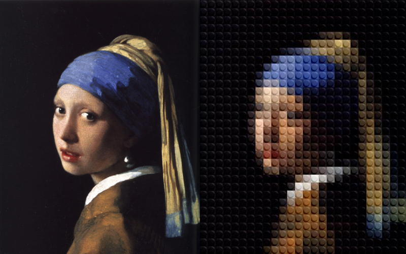

# Legofy [](https://travis-ci.org/JuanPotato/Legofy) [](https://pypi.python.org/pypi/legofy) [](https://pypi.python.org/pypi/legofy) [](https://pypi.python.org/pypi/legofy) [](https://coveralls.io/github/JuanPotato/Legofy?branch=master) [](https://landscape.io/github/JuanPotato/Legofy/master) [](https://gitter.im/JuanPotato/Legofy?utm_source=badge&utm_medium=badge&utm_campaign=pr-badge&utm_content=badge)


### What is Legofy?
Legofy is a python program that takes a static image or a gif and converts it to an image to look like it was built out of LEGO 1x1 pieces.




### Requirements
* Python
* Python modules: Pillow, click # pip will install these automatically if using `pip install legofy`
* imagemagick # not needed but recommended

### Bugs
If you find a bug:
  1. Check in the [open issues](https://github.com/JuanPotato/Legofy/issues) if the bug already exists.
  2. If the bug is not there, create a [new issue](https://github.com/JuanPotato/Legofy/issues/new) with clear steps on how to reproduce it.

### Quickstart
```shell
$ pip install legofy
```
or install from this source
```shell
$ git clone https://github.com/richiehug/Legofy.git
$ cd Legofy
$ python setup.py install
```

### Usage
```
Usage: legofy [OPTIONS] IMAGE [OUTPUT]

  Legofy an image!

Options:
  --size INTEGER                  Number of LEGO bricks the longest side of the legofied image should have.
  --dither / --no-dither          Choose whether the dither algorithm should be used to spread the color approximation error.
  --palette [all|solid|special|mono|transparent]
                                  Choose if a specific LEGO color palette should be used.
  --highres / --nohighres         Use highres to enhance the final output by using a larger base lego picture (200px vs 30px).
  --resize INTEGER                Resize the image to max width & max length while keeping its ratio.
  --help                          Show this message and exit.
```

#### Palette
There are 4 palettes: solid (45 colors), special (8 colors), mono (2 colors) and transparent (14 colors).
You can use a specific one or all 4.
```shell
$ legofy --palette solid image.jpg
$ legofy --palette transparent image.jpg
$ legofy --palette effects image.jpg
$ legofy --palette all image.jpg
```

### Installation
1. Download and install all requirements
 * python from the [official python website](https://www.python.org/)
 * imagemagick from the [official imagemagick website](https://imagemagick.org/)
2. Download this project by using the download zip button on this page, or running `git clone https://github.com/richiehug/Legofy`
 * If you downloaded a zip file, please unzip it
3. Open a command line and navigate to the project folder
4. Run `python setup.py install` while in the project folder
5. You can now use Legofy anywhere, see [usage](#usage) for more help

### Forks

* JavaScript: [Legofy](https://github.com/Wildhoney/Legofy)
